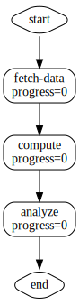
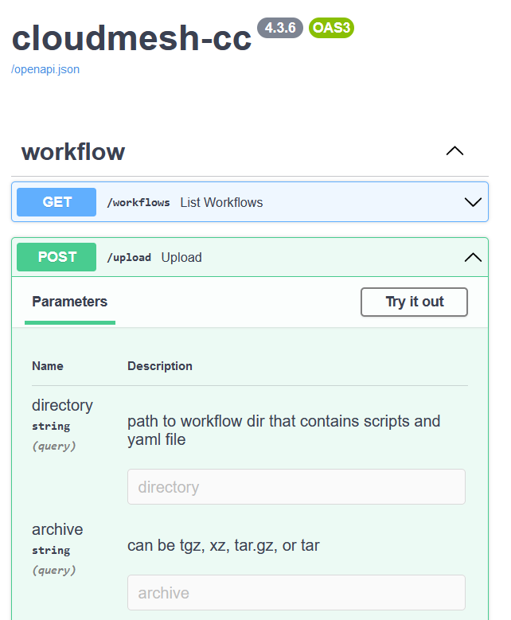

# Workflow Quickstart Menu

The Cloudmesh Compute Cluster service allows you to execute
analytical, computational workflows which run programs on remote
compute resources. We specify not only a list of commands to be
executed, but the commands can also have dependencies between each
other expressed through a direct, cyclic graph. Here is an example
workflow to be executed, portrayed by a graph of sequential nodes (jobs).


| Step 0             |  Step 1  | Step 2  | Step 3  |
| Definition             |  Running first Task  | Running second Task  | Completed Workflow  |
:-------------------------:|:-------------------------:|:-------------------------:|:-------------------------:|
|  |  |  |  |

**Figure:** Execution and display graph of an example workflow over time


We can execute a similar workflow example by using one of
our APIs.

To begin, we assume you are standing in
the cloudmesh-cc directory. Let us check it out with

```bash
git clone https://github.com/cloudmesh/cloudmesh-cc.git
cd cloudmesh-cc
pip install -e .
```

We also assume you start the service with

```bash
cms cc start --reload
```

## Creating a simple example

First let us create a simple example. 

Let us use one of the default test workflows and copy it into a
temporary directory:


```bash
mkdir -p /tmp/workflow
cp tests/workflows/workflow.yaml /tmp/workflow
cp tests/workflow-sh/*.sh /tmp/workflow
```

Now we can test various ways on how to interact with the service.

## Upload and run a workflow embedded in a tar file

We can upload a singular archive file which contains all the
workflow files, including the yaml specification file and the
scripts. Providing an archive file such as a `tar` or `tar.gz`
may enable the workflow to be better suited towards portability
and simplicity, where one can share an archive file with another
user.

### Create tar archive file

Before uploading a tar archive file, we must first create it
using the previous example yaml and scripts that we copied.

```bash
tar -C /tmp/workflow -cf workflow.tar .
```

### Option 1: Upload via `curl`

We can upload the archive file by using the `curl` terminal
command as follows:

```bash
curl -X 'POST' \
  'http://127.0.0.1:8000/upload?archive=workflow.tar' \
  -H 'accept: application/json' \
  -d ''
```

### Option 2: Upload via `/docs`

Navigate to `http://127.0.0.1:8000/docs` and use
the POST Upload method.



Please click `Try it out`
and then enter `/tmp/workflow/workflow.tar` in the
`archive` field and then click Execute.

To run, navigate to homepage at `http://127.0.0.1:8000/` and
click the workflow on the left side. Then click Run.

### Option 3: Upload via the Python API

We will use Python requests to demonstrate this upload
feature.

```python
import requests

r = requests.post('http://127.0.0.1:8000/upload?archive=workflow.tar')
print(r)
print(r.text)
```

Printing `r` returns the response code from the API (a code of
200 indicates success). Printing `r.text` returns the message
from the API, such as a success or error message.

## Upload a dir that contains workflow yaml and scripts

Additionally, the user can specify a workflow directory which
contains the yaml specification file and the scripts. This way,
pre-archival of the directory is not needed. The program sets up
the workflow by copying the necessary files from the specified
directory.

There are three different ways to upload the dir: via `curl` on
the command line, via the browser GUI, and via the Python API.

### Option 1: Upload via `curl`

A workflow can be uploaded easily with a curl command from the command
line. On the command line execute:

```bash
curl -X 'POST' \
  'http://127.0.0.1:8000/upload?directory=/tmp/workflow' \
  -H 'accept: application/json' \
  -d ''
```

TODO: on windows it also should work with / and not \ We make explicit note here
when using a drive we do /c/ ....

### Option 2: Upload via `/docs`

Navigate to `http://127.0.0.1:8000/docs` and use
the POST Upload method.

Click `Try it out` and then enter `/tmp/workflow` 
in the directory field and then click Execute.

To run, navigate to homepage at `http://127.0.0.1:8000/` and
click the workflow on the left side. Then click Run.

### Option 3: Upload via the Python API

We will use python requests to demonstrate the upload
of the workflow.

```python
import requests

r = requests.post('http://127.0.0.1:8000/upload?directory=/tmp/workflow')
print(r)
print(r.text)
```

Printing `r` returns the response code from the API (a code of
200 indicates success). Printing `r.text` returns the message
from the API, such as a success or error message.

## Parameters to the Upload File

The upload URL can take different parameters, such as
directory, archive, and yaml. Only one of them can be
used at a time.

The directory parameter indicates that the contents of
a specified directory will be transferred into a workflow.

The archive parameter indicates that an archive file, such
as a `tar` file, will be extracted and its contents will
be transferred into a workflow.

The yaml parameter indicates that only a yaml file will be
uploaded without any corresponding scripts. Uploading a yaml
file by itself allows for a script specified by the yaml 
to be uploaded later. The yaml can even work without scripts
by using the `exec` specification within the yaml.

