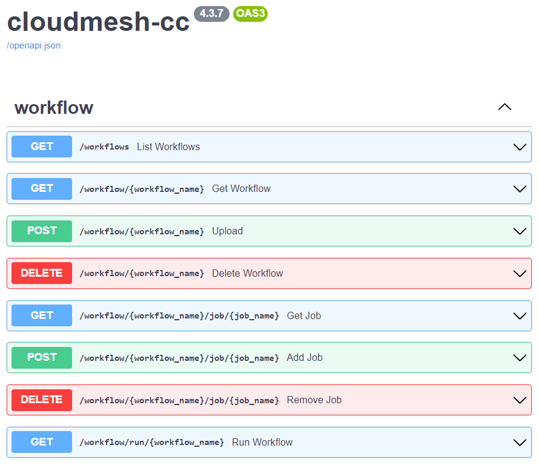

# Hybrid Multi-Cloud Analytics Services Framework

**Cloudmesh Controlled Computing through Workflows**

Gregor von Laszewski (laszewski@gmail.com)$^*$,
Jacques Fleischer

$^*$ Corresponding author


## Background

High-performance computing (HPC) is for decades a very important tool
for science. Scientific tasks can be leveraging the processing power
of a supercomputer so they can run at previously unobtainable high
speeds or utilize specialized hardware for acceleration that otherwise
are not available to the user. HPC can be used for analytic programs
that leverage machine learning applied to large data sets to, for
example, predict future values or to model current states. For such
high-complexity projects, there are often multiple complex programs
that may be running repeatedly in either competition or
cooperation. Leveraging for example computational GPUs leads to
several times higher performance when applied to deep learning
algorithms. With such projects, program execution is submitted as a
job to a typically remote HPC center, where time is billed as node
hours. Such projects must have a service that lets the user manage and
execute without supervision. We have created a service that lets the
user run jobs across multiple platforms in a dynamic queue with
visualization and data storage.

See @fig:fastapi-service.

{#fig:fastapi-service width=50%}


## Workflow Controlled Computing

This software was developed end enhancing Cloudmesh, a suite of
software to make using cloud and HPC resources easier. Specifically,
we have added a library called Cloudmesh Controlled Computing
(cloudmesh-cc) that adds workflow features to control the execution of
jobs on remote compute resources.

The goal is to provide numerous methods of specifying the workflows on
a local computer and running them on remote services such as HPC and
cloud computing resources. This includes REST services and command
line tools. The software developed is freely available and can easily
be installed with standard python tools so integration in the python
ecosystem using virtualenv's and anaconda is simple.


## Workflow Functionality

A hybrid multi-cloud analytics service framework was created to manage
heterogeneous and remote workflows, queues, and jobs. It was designed
for access through both the command line and REST services
to simplify the coordination of tasks on remote computers. In
addition, this service supports multiple operating systems like macOS,
Linux, and Windows 10 and 11, on various hosts: the computer's
localhost, remote computers, and the Linux-based virtual image WSL.
Jobs can be visualized and saved as a YAML and SVG data file. This
workflow was extensively tested for functionality and reproducibility.

## Quickstart

To test the workflow program, prepare a cm directory in your home
directory by executing the following commands in a terminal:

```bash
cd ~
mkdir cm
cd cm
pip install cloudmesh-installer -U
cloudmesh-installer get cc
git clone https://github.com/cloudmesh/cloudmesh-cc
cd cloudmesh-cc
pip install -e .
pip install -r requirements.txt
pytest -v -x --capture=no tests/test_080_workflow_clean.py
```

This test runs three jobs within a singular workflow: the first job
runs a local shell script, the second runs a local Python script, and
the third runs a local Jupyter notebook.

## Application demonstration using MNIST

The Modified National Institute of Standards and Technology Database
is a machine learning database based on image processing Various MNIST
files involving different machine learning cases were modified and
tested on various local and remote machines These cases include
Multilayer Perceptron, LSTM (Long short-term memory), Auto-Encoder,
Convolutional, and Recurrent Neural Networks, Distributed Training,
and PyTorch training

See @fig:workflow-uml.

{#fig:workflow-uml}

## Design

The hybrid multi-cloud analytics service framework was created to
ensure running jobs across many platforms. We designed a small and
streamlined number of abstractions so that jobs and workflows can be
represented easily. The design is flexible and can be expanded as each
job can contain arbitrary arguments. This made it possible to custom
design for each target type a specific job type so that execution on
local and remote compute resources including batch operating systems
can be achieved. The job types supported include: local job on Linux,
macOS, Windows 10, and Windows 11, jobs running in WSL on Windows
computers, remote jobs using ssh, and a batch JObs using Slurm.


In addition, we leveraged the exiting Networkx Graph framework to
allow dependencies between jobs. This greatly reduced the complexity
of the implementation while being able to leverage graphical displays
of the workflow, as well as using scheduling jobs with for example
topological sort available in Networkx. Custom schedulers can be
designed easily based on the dependencies and job types managed
through this straightforward interface. The status of the jobs is
stored in a database that can be monitored during program
execution. The creation of the jobs is done on the fly, e.g. when the
job is needed to be determined on the dependencies when all its
parents are resolved. This is especially important as it allows
dynamic workflow patterns to be implemented while results from
previous calculations can be used in later stages of the workflow.

We have developed a simple-to-use API for this so programs can be
formulated using the API in python. However, we embedded this API also
in a prototype REST service to showcase that integration into
language-independent frameworks is possible. The obvious functions to
manage workflows are supported including graph specification through
configuration files, upload of workflows, export, adding jobs and
dependencies, and visualizing the workflow during the execution. An
important feature that we added is the monitoring of the jobs while
using progress reports through automated log file mining. This way
each job reports the progress during the execution. This is especially
of importance when we run very complex and long-running jobs.


The REST service was implemented in FastAPI to leverage a small but
fast service that features a much smaller footprint for implementation
and setup in contrast to other similar REST service frameworks using
python.

This architectural component building this framework is depicted
@fig:workflow-uml.  The code is available in this repository and
manual pages are provided on how to install it:
[cloudmesh-cc](https://github.com/cloudmesh/cloudmesh-cc).

## Summary

The main interaction with the workflow is through the command line.
With the framework, researchers and scientists should be able to
create jobs on their own, place them in the workflow, and run them on
various types of computers.

In addition, developers and users can utilize the built-in OpenAPI 
graphical user interface to manage
workflows between jobs. They can be uploaded as YAML files or individually 
added through the build-in debug framework.

Improvements to this project will include code cleanup and manual development.

## References

A poster based on a pre-alpha version of this code is available as ppt
and PDF file. However, that version is no longer valid and is
superseded by much improved efforts. The code summarized in the
pre-alpha version was mainly used to teach a number of students Python
and how to work in a team

* [Poster Presentation (PPTX)](https://github.com/cloudmesh/cloudmesh-cc/raw/main/documents/analytics-service.pptx)
* [Poster Presentation (PDF)](https://github.com/cloudmesh/cloudmesh-cc/raw/main/documents/analytics-service.pdf)

Please note also that the poster contains inaccurate statements and
descriptions and should not be used as a reference to this work.

## Acknowledgments

Continued work was in part funded by the NSF CyberTraining: CIC:
CyberTraining for Students and Technologies from Generation Z with the
award numbers 1829704 and 2200409.
We like to thank the following contributors for their help and evaluation in a 
pre-alpha version of the code: Jackson Miskill, Alex Beck, Alison Lu.
We are excited that this effort contributed significantly to their
increased understanding of Python and how to develop in a team using
the Python ecosystem.


